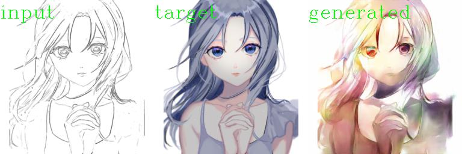

# Introduction
This repository implements pix2pix with Pytorch and trained with [Anime-Sketch-Colorization-Pair-Dataset](https://www.kaggle.com/ktaebum/anime-sketch-colorization-pair).
The train image is 256 x 512 (H x W).

# Set up environment
use Anaconda to create the environment from environment.yml

# Train:
Download the dataset from [Anime-Sketch-Colorization-Pair-Dataset](https://www.kaggle.com/ktaebum/anime-sketch-colorization-pair) and uncompress it  
```
python train.py --train_dir <train-image-directory> --val_dir <val-image-directory> --train_epochs 100
```
The generated model and images of every epoch will be saved in folder "./train"

# Trained checkpoint

Can be downloaded from https://drive.google.com/file/d/1KqdtD525Y6o1-ng3_9fsx9VLen6r8gL8/view?usp=sharing  
Training detail:  
	Epoch 1 ~ 100: lr = 0.0002  
	Epoch 101 ~ 120: lr = 0.00005  
	GPU: RTX 2080ti. 8min/epoch  

# Colorize sketchs
```
python generate.py --test_dir <test-image-directory> --checkpoint <checkpoint-path>
```
The generated images will be saved in folder "./result"
# Generated samples





